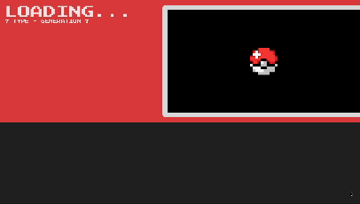
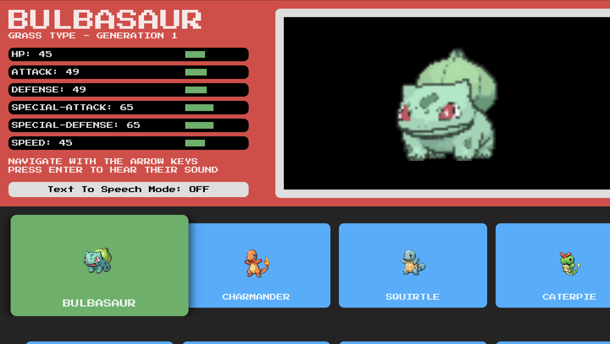
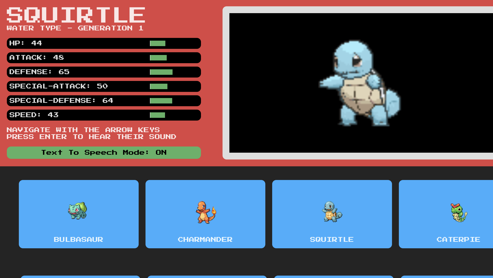

# PokeFlix



PokeFlix is a [Pokedex](https://bulbapedia.bulbagarden.net/wiki/Pok%C3%A9dex) application with a Netflix-like TV style user interface built with React. All Pokemon data courtesy of [PokeAPI](https://pokeapi.co).

## Website

You can try out PokeFlix [here.](https://main--magenta-pavlova-6f3755.netlify.app/)

## Controls

PokeFlix is meant to be used like an application on a smart TV. Use the arrow keys and the enter button to simulate the remote. Pokemon buttons can be selected to hear their sounds. Navigate up to the "text to speech mode" toggle and select it to toggle the mode on and off. The text to speech mode was built to simulate a rudimentary version of the accessibility options found on TVs and other devices.

## Screenshots





## Installation and Setup Instructions

Clone this repository. You will need Yarn and npm installed globally on your machine.

Installation:

```
yarn install
```

To Run Test Suite:

```
yarn test
```

To Start Server:

```
yarn dev
```

To Visit App:

```
localhost:5173
```
